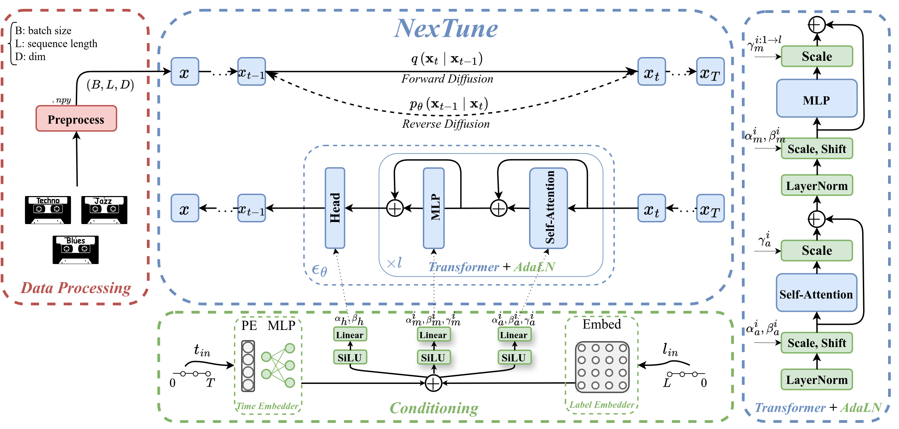

## The official PyTorch implementation of NexTune <br><sub>Denoising Diffusion Model for Song Generation</sub>
This project features a song generation model using diffusion models. The model is capable of conditioning on song history, generating plausible future seconds in the song.



The repository is organized as follows:
  * [Documentation](#documentation)
  * [Folder Structure](#folder-structure)
  * [Setup](#setup)
  * [Data Processing](#data-processing)
  * [Training](#training)
  * [Sampling and Evaluation](#sampling-and-evaluation)
 

## Documentation
* The diffusion process is modified from OpenAI's diffusion repos: [GLIDE](https://github.com/openai/glide-text2im/blob/main/glide_text2im/gaussian_diffusion.py), [ADM](https://github.com/openai/guided-diffusion/blob/main/guided_diffusion), and [IDDPM](https://github.com/openai/improved-diffusion/blob/main/improved_diffusion/gaussian_diffusion.py).

## Folder Structure
``` 
nextune-main/
├── configs/                           # Configuration files for training/sampling
│     ├── config_sample.yaml           # Sampling-specific configurations
│     └── config_train.yaml            # Training-specific configurations
├── diffusion/                         # Core diffusion modules
├── docs/                              # Documentation
│     ├── assets/                      # Documentation assets
│     └── README.md                    # Documentation overview and usage guide
├── models/                            # Model and architecture components
│     ├── backbones/                   # Backbone networks for NexTune
│     │   ├── model_td.py              # NexTune backbone model
│     │   └── layers.py                # Custom layers and utility functions
│     └── test_model_td.py             # Test model_td backbone efficiency
├── scripts/                           # Scripts for running tasks
│     ├── sample.py                    # Sampling script
│     └── train.py                     # Training script
├── utils/                             # Utility functions and helper scripts
│     ├── metrics.py                   # Evaluation metrics functions
│     └── __init__.py                  # Makes utils a package
├── main.py                            # Main file to run train and sample
├── requirements.txt                   # Project dependencies
└── README.md                          # Project overview, setup, and usage instructions
```

## Setup

First, download and set up the repo:

```bash
git clone https://github.com/TunAI-Lab/nextune.git
cd nextune
```

Then, create a python 3.11 conda env and install the requirements

```bash
# Install NexTune
conda create --name venv python=3.10
conda activate venv
pip install -r requirements.txt
```

## Data Processing
To launch data pre-processing :
```bash
python -m scripts.preprocess --config configs/config_process.yaml
```

To launch data post-processing:
```bash
python -m scripts.postprocess --config configs/config_process.yaml
```

## Training
We provide a training script for NexTune model in [`scripts/train.py`](scripts/train.py).

To launch NexTune training with `N` GPUs on one node:
```bash
accelerate launch -m scripts.train --config configs/config_train.yaml
```

To launch NexTune training with `1` GPU (id=1):
```bash
accelerate launch --num-processes=1 --gpu_ids 1 -m scripts.train --config configs/config_train.yaml
```


## Sampling and Evaluation
To sample trajectories from a pretrained NexTune model, run:
```bash
python -m scripts.sample --config configs/config_sample.yaml
```

The sampling results are automatically saved in the model's designated results directory, organized within the samples subfolder for easy access.