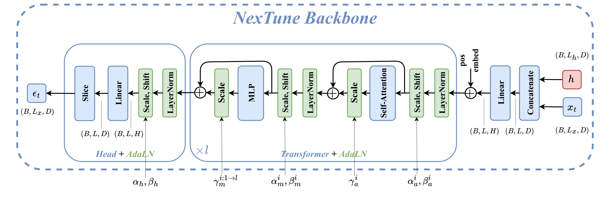

## Abstract

This project explores predicting the next 5 seconds of music based on a 10-second history using diffusion models, focusing on genres such as electro, jazz, and blues. Traditional music generation models, often relying on latent embeddings or autoregressive methods, face limitations in maintaining genre coherence and temporal consistency over longer segments. Leveraging the ability of diffusion models to capture complex, multimodal distributions, we introduce NexTune, a genre-conditional diffusion model designed to predict realistic future audio segments by learning robust musical patterns and continuity. Key challenges include managing diverse genre characteristics and ensuring coherent stylistic transitions. NexTune incorporates a transformer-based architecture to process temporal dependencies effectively, enabling seamless and genre-consistent predictions for music generation, with applications in automated composition, recommendation systems, and adaptive soundscapes.

## Backbone Architecture
